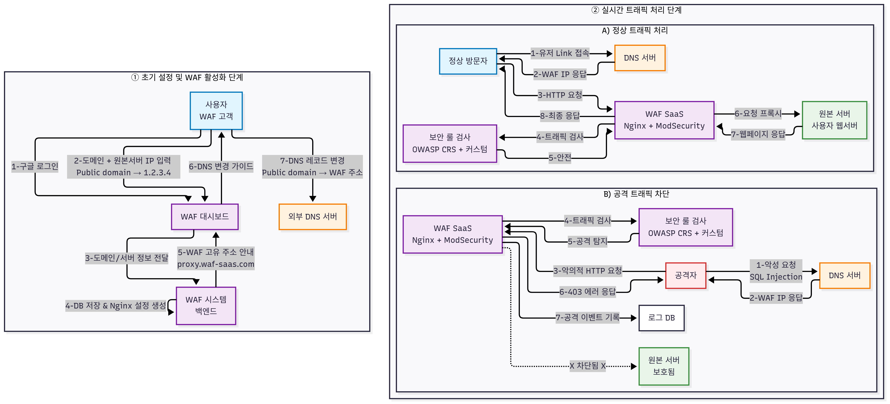

# WAF (Web Application Firewall) SaaS

OWASP ModSecurity CRS와 Nginx를 기반으로 한 리버스 프록시형 WAF를 멀티 테넌트 SaaS 형태로 관리·운영하기 위한 프로젝트입니다. 프론트엔드 대시보드에서 테넌트/도메인별 WAF 설정과 커스텀 룰을 손쉽게 관리하고, 실시간 로그를 통해 트래픽과 차단 이벤트를 모니터링할 수 있습니다.

## Flow



- 클라이언트 요청은 `Nginx + ModSecurity (OWASP CRS)`를 통해 검사되며 허용/차단 여부가 결정됩니다.
- 접근 로그/감사 로그는 파일로 기록되고 수집 파이프라인(Fluent Bit)을 통해 DB에 저장되며, API를 통해 대시보드로 전달됩니다.
- 운영자는 대시보드에서 테넌트/도메인, 커스텀 룰을 관리합니다. 룰 변경 시 테넌트 전용 설정 파일이 갱신되고 Nginx가 Reload되도록 설계되어 있습니다.

## MVP

- **Google 로그인**: Google OAuth 기반 로그인으로 간편한 인증 제공.
- **멀티 테넌트**: 테넌트별로 도메인, 규칙, 로그를 논리적으로 분리 관리.
- **커스텀 룰 설정**: ModSecurity/CRS 룰을 템플릿 기반으로 테넌트 단위 커스터마이징 및 적용.
- **실시간 로그 확인**: Nginx/ModSecurity 로그를 실시간으로 스트리밍해 대시보드에서 조회 및 필터링.

## 빠른 시작

사전 요구사항: Docker, Docker Compose

```bash
docker compose up -d
```

컨테이너 상태 및 로그 확인:

```bash
docker compose ps
docker compose logs -f waf-nginx
docker compose logs -f backend-server
docker compose logs -f frontend
```

중지/정리:

```bash
docker compose down
```

---

## 폴더 구조 (요약)

```text
WAF/
  ├─ docker-compose.yml
  ├─ waf-diagram.png
  ├─ backend-server/                 # NestJS 백엔드(API, 인증, 규칙/도메인/로그 관리)
  │  ├─ src/
  │  │  ├─ app.module.ts
  │  │  ├─ auth/                     # Google 로그인 등 인증 모듈
  │  │  ├─ database/                 # DB 모듈
  │  │  ├─ domains/                  # 도메인 관리, Nginx 연동 서비스
  │  │  ├─ logs/                     # 로그 엔드포인트/서비스
  │  │  ├─ rules/                    # 룰 관리, 템플릿/유틸
  │  │  └─ users/
  │  ├─ Dockerfile
  │  └─ package.json
  ├─ frontend/                       # Next.js 대시보드(로그/룰/도메인/테넌트 UI)
  │  ├─ src/
  │  │  ├─ app/
  │  │  │  └─ dashboard/             # 도메인/룰/로그 페이지
  │  │  ├─ components/
  │  │  ├─ services/                 # API 호출 래퍼
  │  │  └─ lib/                      # 타입/유틸/템플릿
  │  ├─ Dockerfile
  │  └─ package.json
  ├─ modsecurity-crs-nginx/          # WAF 런타임 자원(Nginx, ModSecurity, CRS, 템플릿/로그)
  │  ├─ modsecurity-crs/
  │  │  ├─ rules/custom_rules.conf
  │  │  ├─ logs/
  │  │  └─ templates/modsecurity-override.conf.template
  │  └─ nginx/
  │     ├─ rules/custom_rules.conf
  │     ├─ logs/
  │     └─ templates/
  │        ├─ users.conf.template
  │        └─ logging.conf.template
  ├─ observability/
  │  └─ fluent-bit/                  # 로그 수집(옵션)
  │     ├─ fluent-bit.conf
  │     └─ parsers_multiline.conf
  └─ tenant-example/                 # 테넌트 예제 서비스(로컬 테스트용)
```

## 참고

- OWASP CRS: `https://coreruleset.org/`
- ModSecurity: `https://github.com/SpiderLabs/ModSecurity`
- OWASP ModSecurity CRS Nginx 이미지: `https://hub.docker.com/r/owasp/modsecurity-crs`
